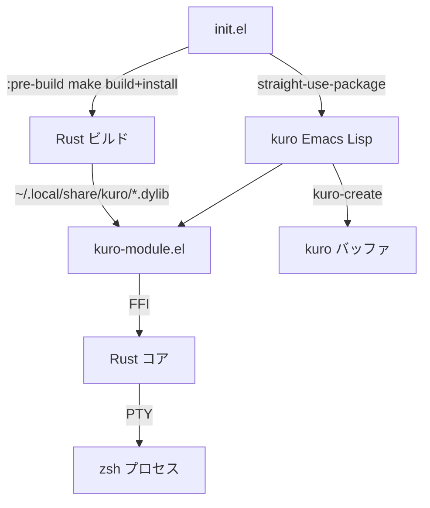
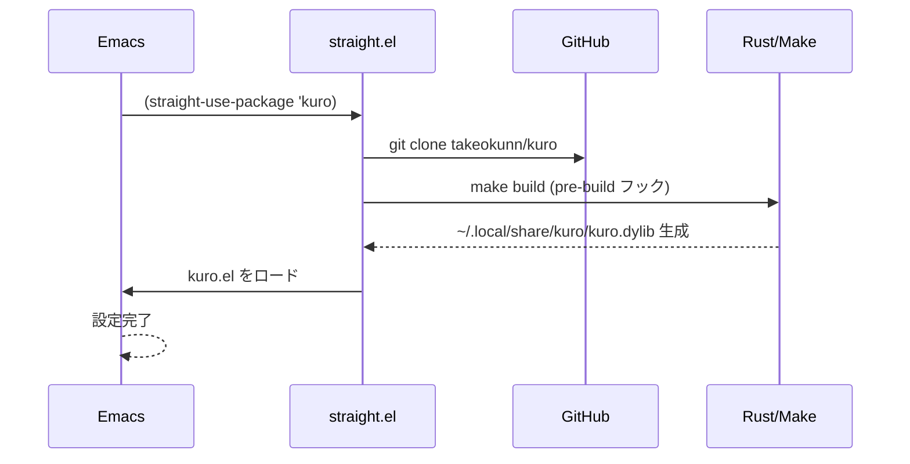
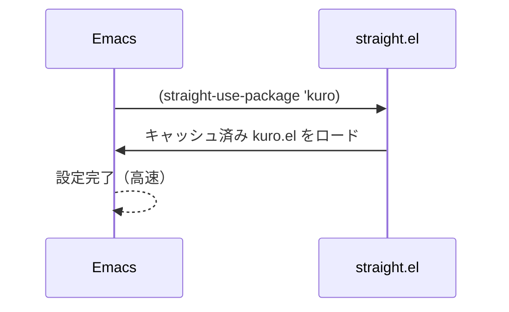
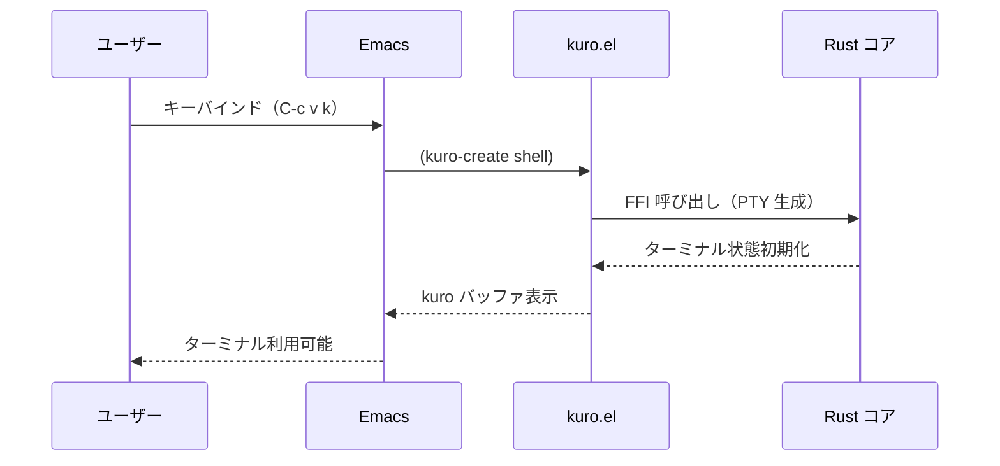
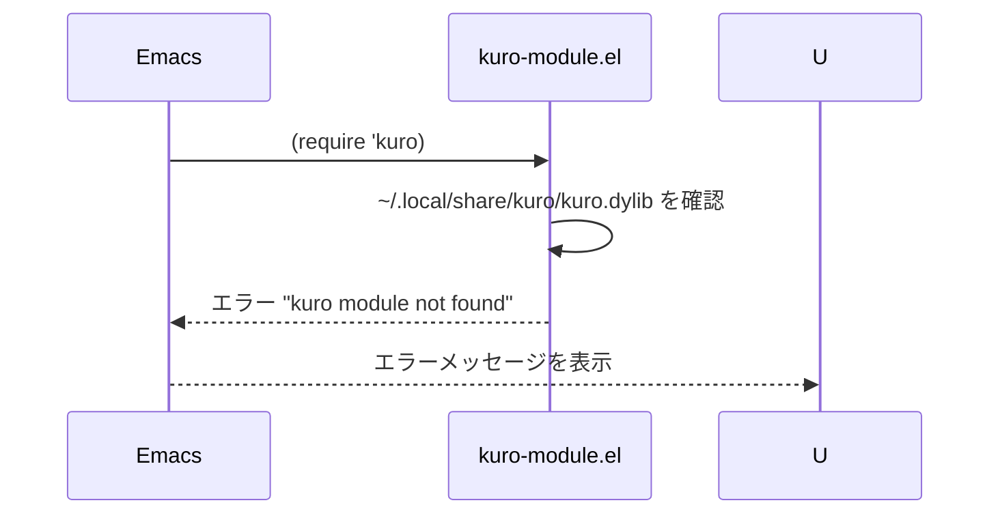

# Design: setup-kuro

## Overview
`make build && make install` で Rust バイナリを `~/.local/share/kuro/` にインストールし、straight.el の `:pre-build` フックでビルドを自動化、`use-package` で kuro を宣言的に設定する。

## Architecture

### Component Diagram



### Data Model

```
~/.local/share/kuro/
└── kuro.dylib          ; Rust ダイナミックライブラリ（macOS）
                        ; Linux では kuro.so

~/.emacs.d/straight/repos/kuro/
├── emacs-lisp/         ; 23 モジュール
│   ├── kuro.el         ; メインエントリポイント
│   ├── kuro-module.el  ; FFI ブリッジ
│   └── ...
├── rust-core/          ; Rust ソース
└── Makefile
```

## Sequence Diagrams

### Emacs 起動時（初回）



### Emacs 起動時（2回目以降）



### kuro ターミナル起動



### エラー：バイナリが存在しない



## Implementation Notes

### straight.el の設定方針

`:pre-build` フックで `make build` と `make install` を実行する。`make install` が `~/.local/share/kuro/` にバイナリを配置する。

```elisp
(use-package kuro
  :straight (:type git :host github :repo "takeokunn/kuro"
             :files ("emacs-lisp/*.el")
             :pre-build (("make" "build") ("make" "install")))
  ...)
```

### キーバインド設計

eat との衝突を避けるため、`C-c v k` を kuro に割り当てる。

| キー | コマンド | 説明 |
|------|----------|------|
| `C-c v k` | `kuro-create` | 新しい kuro ターミナルを開く |
| `C-c v t` | `eat`（既存） | eat ターミナル（変更なし） |

### kuro バッファの表示設定

eat と同様に、kuro バッファでは行番号・ハイライトを無効化する。

```elisp
:hook
(kuro-mode . (lambda ()
               (display-line-numbers-mode -1)
               (hl-line-mode -1)))
```

### Error Handling

| エラーケース | 対処方針 |
|-------------|---------|
| Rust バイナリ未インストール | `make build && make install` を手動で実行するよう案内 |
| Rust バージョン不足 | make コマンドのエラーログに従い rustup で更新 |
| straight.el ビルド失敗 | `M-x straight-rebuild-package RET kuro` で再試行 |

### Testing Strategy

- **手動確認**: Emacs 起動後に `M-x kuro-create` が正常動作するか
- **バッファ確認**: 行番号・ハイライトが無効になっているか
- **eat 共存確認**: `C-c v t` で eat が開き、`C-c v k` で kuro が開くか
- **起動速度確認**: 2回目以降の Emacs 起動でビルドがスキップされるか

### Non-functional Considerations

- **パフォーマンス**: Rust ビルドは初回のみ（straight.el のキャッシュ機構を活用）
- **セキュリティ**: GitHub から直接クローンするため HTTPS を使用（straight.el のデフォルト）
- **macOS 対応**: `make install` が `.dylib` を配置、Linux では `.so` を配置（Makefile が自動判定）
